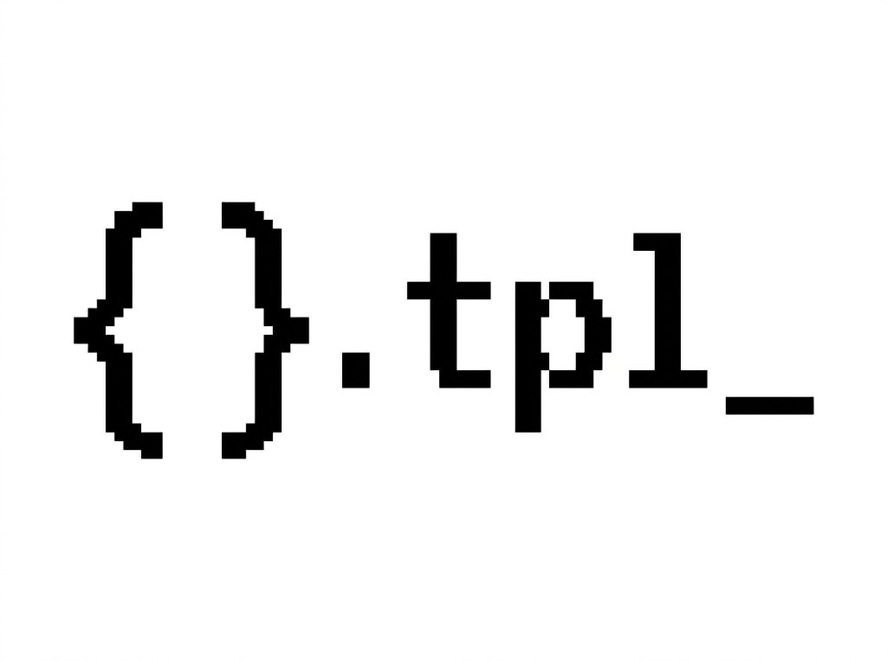

<p align="center">
  
</p>

# TPL — The Prompting Library

Stop hiding your prompts in backticks.

TPL lets prompts live in plain `.tpl.md` files, then generates typed TypeScript functions you can import from your app.

No dashboard. No hosted runtime. No "prompt management platform" with a pricing page and a haunted enterprise sales form.

Just files in your repo.

**Alpha:** TPL is pre-1.0. Minor versions may introduce breaking changes while the API and file format settle.

```markdown
<!-- src/shared/base-persona.tpl.md -->
You are a helpful, concise assistant. Respond in a {{tone|professional}} tone.
<!-- Inline variables with {{ ... }}. Here, `tone` defaults to "professional". -->
```

```markdown
<!-- src/features/auth/welcome-email.tpl.md -->
{{> ../../shared/base-persona as persona}}
<!-- Reuse another template with {{> ... }}. "as persona" will be a helpful alias later. -->

Write a warm welcome email to {{userName}} who just signed up for {{productName}}.
Their plan is {{planType}}. Keep it under 150 words.
```

```typescript
import { generateText } from "ai";
import { prompts } from "./lib/tpl.gen.js";

const { text } = await generateText({
  model,
  prompt: prompts.features.auth.welcomeEmail({
    // autocomplete works here
    userName: "Alice",
    productName: "Acme AI",
    planType: "Pro",
    persona: { // Args for nested template goes here. Customize the name with "as alias".
      tone: "friendly",
    },
    // missing field? wrong name? wrong type? TypeScript yells before prod does.
  }),
});
```

## Why This Exists

- Prompts are product code. They deserve review, diffs, search, comments, and ownership.
- Inline prompt strings rot. Types keep call sites honest.
- AI coding agents understand files better than mystery strings buried in handlers.
- Markdown is the best prompt editor we already have.

## Quick start

Paste this to your coding agent:

```text
Add TPL to this repo. Fetch the raw TPL README, read the full agent setup prompt under Quick start, and follow it closely: https://raw.githubusercontent.com/TimurKr/tpl/main/README.md
```

Want to review what you just asked the machine to do? Expand this:

<details>
<summary><strong>See the full agent setup prompt</strong></summary>

```text
You are helping add TPL (The Prompting Library) to this TypeScript codebase.

Goal:
Move real prompt prose out of inline strings and into .tpl.md files. TPL will generate typed TypeScript prompt builder functions so prompt call sites get autocomplete and compile-time checks.

Do not only "move strings around." TPL should become the main prompt-building mechanism. Use this as a chance to make prompt ownership clearer, but do it in two passes.

Two-pass workflow:
- Pass 1: adopt TPL with minimal behavioral and structural change. Extract prompt prose, wire generation, refactor call sites, and verify. Do not do a broad folder/module restructure yet.
- Pass 2: after Pass 1 is working, analyze the repo and propose a bolder prompt architecture. Do not implement that restructure unless the user explicitly approves it.

Target architecture for the proposal:
- Markdown templates should own the model-facing prompt: headings, labels, descriptions, separators, fallback text, truncation notes, ordering notes, and conditional wording.
- TypeScript should gather and normalize data, then pass that data into generated prompt functions.
- TypeScript should not keep building prompt prose with string concatenation, arrays of hard-coded prompt lines, or helper functions whose main job is formatting model-facing text.
- Prefer one top-level template for a full prompt, such as `assistant-instructions.tpl.md`, with variables and partials for sections.
- Ideally the app ends with one obvious call like `prompts.systemPrompt({...})`. If dynamic repeated sections are needed, render each item with an item template, join those rendered items, and pass the result into the top-level template.
- It is okay for TypeScript to compute facts like file contents, counts, config values, booleans, and lists. It is not okay for TypeScript to remain the place where prompt wording is authored.

What TPL does:
- Source prompts live in .tpl.md, .tpl.mdx, .tpl.txt, or .tpl.html files.
- Running `tpl generate` creates sibling `*.tpl.gen.ts` files.
- Running `tpl generate` also creates a manifest at `lib/tpl.gen.ts` by default.
- App code imports from `./lib/tpl.gen.js` and calls `prompts.promptName(...)`.
- Generated files are disposable. Do not hand-edit them.

Important syntax:
- `{{name}}` becomes a required string variable.
- `{{count:number}}` becomes a required number variable.
- `{{active:boolean}}` becomes a required boolean variable.
- `{{tags:string[]}}` becomes a required string array variable.
- `{{tone|friendly}}` becomes an optional string with a default.
- `{{limit:number|10}}` becomes an optional number with a default.
- `{{#if note}}...{{/if}}` renders only when `note` is truthy.
- `{{> ../../shared/base-persona}}` includes another template by relative path.
- `{{> ../../shared/output-format as output}}` includes another template and exposes its variables under `output`.

Implementation steps:

1. Inspect the project.
   - Detect the package manager.
   - Detect whether this is a monorepo and which package owns the prompts.
   - Detect the main app scripts.
   - Detect whether generated files are committed in this repo.
   - Check TypeScript module settings so imports use the right style.
   - Prefer package-local TPL config/output in monorepos. Do not make unrelated packages depend on one package's generated template declarations unless the repo already shares source that way.
   - Identify distinct prompt systems before editing. If the repo has multiple unrelated agents, products, apps, packages, or prompt families, do not assume the scope.
   - If multiple unrelated prompt systems exist, ask the user which one to migrate first, or whether to migrate all. Use the environment's structured ask/user-question tool if available. If not available, ask in chat and wait.

2. Install TPL as a dev dependency.
   - npm: `npm install -D the-prompting-library`
   - pnpm: `pnpm add -D the-prompting-library`
   - bun: `bun add -D the-prompting-library`
   - yarn: `yarn add -D the-prompting-library`

3. Add scripts.
   - Development: run `tpl watch` alongside the normal dev server.
     Example: `"dev": "tpl watch & next dev"`
   - If the repo already uses a parallel runner, use that instead of shell `&`.
   - If `&` would be brittle, add a separate `dev:tpl` script and document that it should run beside the app dev server.
   - Build/CI: run `tpl generate` before typecheck/build.
     Example: `"build": "tpl generate && next build"`
   - If the repo has a separate typecheck script, ensure `tpl generate` runs before it in CI.
   - If generated files are committed, add `tpl check` to CI to catch drift.

4. Find inline prompts.
   Search for:
   - template literals or strings assigned to names like `prompt`, `systemPrompt`, `userPrompt`, `instructions`, `systemMessage`
   - AI SDK calls such as `generateText`, `streamText`, `generateObject`, `streamObject`
   - OpenAI/Anthropic calls and `messages` arrays
   - objects like `{ role: "system", content: "..." }`
   - repeated persona, tone, safety, formatting, or output schema instructions

5. Decide what should become a template.
   - Follow the "Prompt Design Practices" section in this README.
   - Extract large human-authored prompt prose, reusable instructions, output contracts, personas, safety rules, integration guides, and model-facing explanations.
   - Extract section formats when they are part of the final prompt. For example, a source-document section template should contain the heading, explanation, fallback wording, and `{{body}}` placeholder.
   - Extract conditional prompt wording into templates with `{{#if var}}...{{/if}}` instead of building those sentences in TypeScript.
   - Do not split a prompt into subprompts just to make more files. A subprompt should be reused meaningfully or represent one coherent functional unit.
   - Avoid one-line templates. Even if a line appears twice, keep it inline inside the parent template unless it has a real name, ownership, and reason to exist independently.
   - Do not extract tiny non-prompt UI labels or generic string utilities just because they contain text.
   - If TypeScript is still deciding how the prompt reads, move that wording into a template.

6. Place templates with minimal disruption for Pass 1.
   - Prefer colocating each `.tpl.md` file next to the code that currently owns or uses it.
   - If the repo has one large prompt assembler and no clear module structure yet, it is acceptable in Pass 1 to create a temporary prompt folder near that assembler.
   - Keep this pass safe: do not split large TypeScript files into many modules unless that is required to adopt TPL correctly.
   - If you use a temporary central prompt folder, call it out in the final report as a candidate for the Pass 2 restructure.

7. Extract each chosen prompt.
   - Use kebab-case names: `welcome-email.tpl.md`, `classify-ticket.tpl.md`.
   - Add frontmatter when useful:
     ---
     description: Welcome email for new users
     ---
   - Replace interpolated expressions with TPL variables.
   - Add type hints for non-string values.
   - Use defaults for optional values.
   - Use `{{#if var}}...{{/if}}` for optional sections.

8. Extract shared prompt text.
   - Move repeated persona, safety rules, response style, and output format text into partial templates.
   - Example: `src/prompts/base-persona.tpl.md`
   - Include with a relative path like `{{> ../prompts/base-persona}}`.
   - Partials without variables are rendered automatically.
   - Partials with variables become nested typed fields.
   - Prefer `{{> ./relative-path}}` whenever one prompt includes another prompt. Do not render one prompt in TypeScript just to pass its string into another prompt.
   - Passing rendered prompt strings as variables is only acceptable for truly dynamic repeated collections, such as a list of N retrieved documents or N tool descriptions assembled at runtime.

9. Create a top-level prompt template when assembling a large prompt.
   - If the original code had one big `systemPrompt` or prompt assembler, create a top-level `.tpl.md` file for that final prompt.
   - Put the final order, section headings, separators, and section inclusion rules in that top-level template.
   - Use partials for sections that are themselves templates: `{{> ./base-persona}}`, `{{> ./safety-rules}}`, `{{> ./output-format}}`.
   - Use variables only for raw data that TypeScript computed or loaded: `{{userName}}`, `{{workspaceTree}}`, `{{retrievedDocumentSections}}`, `{{availableToolSections}}`.
   - Bad top-level template:
     {{agentRuntime}}
     {{rules}}
     {{workspace}}
   - Good top-level template:
     {{> ./agent-runtime}}
     {{> ./rules}}
     {{> ./workspace}}
   - Bad TypeScript:
     prompts.systemPrompt({
       agentRuntime: prompts.agentRuntime({ workspaceDir }),
       rules: prompts.rules(),
       workspace: prompts.workspace({ tree }),
     })
   - Good TypeScript:
     prompts.systemPrompt({
       agentRuntime: { workspaceDir },
       workspace: { tree },
     })
   - The TypeScript assembler should become mostly data loading plus a final call to the generated top-level prompt function.

10. Generate files.
   - Run `tpl generate`.
   - Confirm each template has a sibling `*.tpl.gen.ts`.
   - Confirm the manifest exists at `lib/tpl.gen.ts` unless the project configured another output.
   - Do not edit generated files manually.
   - Decide whether generated files should be committed by following the repo's existing convention. If source typechecks on clean checkout without running generation, commit them. If CI always generates first, they may be ignored.
   - Ensure the generated `tpl.d.ts` is included by TypeScript. Generated files reference it automatically, but custom TS project boundaries may still require including it explicitly.

11. Refactor call sites.
   Replace inline strings with generated prompt functions.
   Prefer importing from the generated manifest/barrel:
     import { prompts } from "./lib/tpl.gen.js";
   Use direct generated-file imports only when bundle size, client/server boundaries, or package boundaries make the barrel undesirable.

   Before:
     const prompt = `Write a welcome email to ${user.name}. Plan: ${plan}.`;

   Template:
     src/features/email/welcome-email.tpl.md
     ---
     description: Welcome email for new users
     ---
     Write a welcome email to {{userName}}. Plan: {{planType}}.

   After:
     import { prompts } from "./lib/tpl.gen.js";

     const { text } = await generateText({
       model,
      prompt: prompts.features.email.welcomeEmail({
         userName: user.name,
         planType: plan,
       }),
     });

   Remove wrapper-only functions created by the refactor.

   Bad:
     function buildWelcomeEmailPrompt(...args): string {
       return prompts.features.email.welcomeEmail(...args);
     }

   Better:
     const prompt = prompts.features.email.welcomeEmail(...args);

   Keep a wrapper only when it preserves a public API, adds real logic, validates input, or is needed for compatibility. Otherwise update callers to use the generated prompt function directly.

12. Verify Pass 1.
   - Run `tpl generate`.
   - Run the repo's typecheck.
   - Run the repo's tests if they exist.
   - Fix any generated TypeScript errors by correcting template variables, duplicate names, or broken includes.
   - Review the diff for under-extraction. If prompt wording, headings, descriptions, separators, truncation notes, or conditional prose are still authored in TypeScript, move them into templates.
   - Review the diff for manual prompt composition. If TypeScript calls `prompts.foo()` only to pass that string into `prompts.bar({ foo })`, replace that variable slot with a relative include like `{{> ./foo}}` and pass only `foo`'s data as nested variables.
   - Review the diff for over-extraction. If a `.tpl.md` file is only a non-prompt utility string, move it back to TypeScript.
   - Review the diff for over-abstraction. If a `.tpl.md` file is one line, used only once, or not a coherent functional unit, fold it back into its parent template.
   - Search for wrapper-only functions and remove them unless they have a real reason to exist.
   - Check that large prompt assembly flows through a top-level generated prompt function where practical.

13. Propose Pass 2 structure. Do not implement it yet.
   - Write this proposal for a human maintainer, not as terse internal notes.
   - Start with a short status sentence, for example: "Done. TPL is installed and the prompts now live in `.tpl.md` files. The code works, but I see a cleaner structure we could do as a second pass."
   - Explain why Pass 2 would be cleaner in practical terms: easier navigation, fewer giant files, clearer ownership, less prompt assembly code, fewer wrapper functions, or fewer files if over-extraction happened.
   - Include concrete before/after examples from the repo. Name actual files and show where one prompt or section would move.
   - Estimate the impact where possible: approximate lines removed from an assembler, number of temporary prompt files folded back, number of modules created, or which imports/call sites get simpler.
   - Analyze the prompt-building code after Pass 1.
   - If one file still owns one mega prompt with many sections, propose splitting it into small responsibility modules.
   - "Responsibility" can mean product feature, domain, section, topic, prompt subsection, or ownership area. Use the code's natural concepts, not only UI/product features.
   - Group by the thing the section is about: integration, tool, config, memory, workspace, document type, output contract, policy, persona, response format, or another obvious domain.
   - Each proposed responsibility folder should own both the TypeScript that gathers data and the `.tpl.md` files that describe that responsibility's prompt text.
   - Avoid a permanent central `src/prompts/` dumping ground for responsibility-owned prompts. A central prompt folder is only for genuinely shared templates such as base persona, safety rules, or output format.
   - Include a proposed file tree, a list of moves, and the call-site changes needed.
   - Make the recommendation concrete enough that the user can reply "yes, do this" and the next agent can implement it.
   - End with a clear approval question, for example: "Want me to do this Pass 2 restructure?"
   - Example target shape:
     src/
       integrations/
         github/
           index.ts
           github-integration.tpl.md
       memory/
         user-context/
           index.ts
           user-context.tpl.md
       workspace/
         tree/
           index.ts
           workspace-tree.tpl.md

14. Report what changed.
   - List installed package/script changes.
   - List created `.tpl.md` files.
   - List refactored call sites.
   - List wrapper-only functions removed.
   - Mention any prompts intentionally left inline and why.
   - Include the Pass 2 restructure proposal, or say why no restructure is needed.
```

</details>

## Manual setup:

### 1. Install

```bash
npm install -D the-prompting-library
```

### 2. Add scripts

```json
{
  "scripts": {
    "dev": "tpl watch & next dev",
    "build": "tpl generate && next build"
  }
}
```

Replace `next dev` / `next build` with your app's commands, or run `tpl watch` in a separate terminal.

### 3. Create a prompt

```markdown
<!-- src/features/auth/welcome-email.tpl.md -->
Write a welcome email to {{userName}} for {{productName}}.
Keep it under {{wordCount:number|150}} words.
```

### 4. Run the watcher

```bash
npm run dev
```

TPL writes:

```text
src/features/auth/welcome-email.tpl.gen.ts
lib/tpl.gen.ts
lib/tpl.d.ts
```

### 5. Use it

```typescript
import { prompts } from "./lib/tpl.gen.js";

const prompt = prompts.features.auth.welcomeEmail({
  userName: "Alice",
  productName: "Acme AI",
});
```

`wordCount` is optional because the template has a default. `userName` and `productName` are required because the template says so.

## What You Get

- `*.tpl.md` prompt files that sit next to the code that uses them.
- Sibling `*.tpl.gen.ts` files with typed builder functions.
- A manifest at `lib/tpl.gen.ts` with `prompts.<name>()` and `renderPrompt()`.
- Compile-time errors for missing variables, wrong variable names, duplicate prompt names, and broken includes.
- `tpl watch` for development, `tpl generate` for builds, `tpl check` for CI drift checks.

## Prompt Design Practices

TPL works best when Markdown owns the prompt and TypeScript owns the data.

Good practice:

- Put model-facing wording in `.tpl.md`: headings, instructions, separators, fallback text, truncation notes, and conditional prose.
- Use `{{> ./relative-path}}` when one prompt includes another prompt.
- Pass raw data into prompts, not already-rendered prompt strings.
- Keep TypeScript focused on loading files, counting things, reading config, and passing values into generated functions.
- Use the exported `*Variables` interfaces when typing helper boundaries. TPL already exports argument interfaces, so you should not need `Parameters<typeof prompts.somePrompt>[0]`.
- Let the file path define the generated prompt path. Use `namespaceAliases` when framework folders make the generated API noisy.
- Use `as alias` on an include when the default nested variable key would be too long for the parent prompt.
- Create a subprompt only when it is reused meaningfully or is one coherent functional unit with a clear name.

Bad practice:

- Do not build prompt prose with string concatenation in TypeScript.
- Do not call `prompts.foo()` just to pass that rendered string into `prompts.bar({ foo })`; use a relative include like `{{> ./foo}}` and pass `foo`'s variables instead.
- Do not create one-line templates unless that line has real ownership and a reason to exist independently.
- Do not split a readable prompt into tiny fragments just because a sentence appears twice.
- Do not leave a function whose main job is choosing which prompt snippets to render. That logic usually belongs in one parent template with conditionals.
- Do not rename the same prompt in multiple places. Global name lives in frontmatter. Local include arg name lives in `as alias`.

```typescript
// Bad: TypeScript is still composing the prompt.
return prompts.contactsSection({
  body,
  moreNote: prompts.contactsMoreNote({ count }),
});

// Better: contacts.tpl.md owns the wording and conditionals.
return prompts.contacts({
  body,
  count,
  hasMore: count > 0,
});
```

```typescript
import type { ContactsVariables } from "./contacts.tpl.gen.js";

function loadContacts(workspaceDir: string): ContactsVariables {
  return {
    body: readContacts(workspaceDir),
    hasMore: true,
  };
}
```

## Template Syntax

Variables:

```markdown
{{name}}              required string
{{count:number}}      required number
{{active:boolean}}    required boolean
{{tags:string[]}}     required string array
{{tone|friendly}}     optional string with default
{{limit:number|10}}   optional number with default
```

Conditionals:

```markdown
{{#if note}}
Note: {{note}}
{{/if}}
```

If a variable only appears in a conditional, it is typed as `boolean | undefined`. If it also appears as `{{note}}`, `{{note:number}}`, or another variable expression, TPL uses that variable's declared type and marks it optional.

Includes:

```markdown
{{> ../../shared/base-persona}}
{{> ../../shared/output-format as output}}

Write a support reply to {{customerName}}.
```

Includes must use relative paths from the template that contains them. Omit the `.tpl.md` extension. Use `as alias` only to shorten the local nested variable field in the parent template.

Partials with no variables are rendered automatically. Partials with variables become nested typed fields, so callers only pass what is actually needed.

## Naming

Template paths become nested prompt names:

```text
src/features/auth/welcome-email.tpl.md -> prompts.features.auth.welcomeEmail()
src/search/query.tpl.md                -> prompts.search.query()
```

If a framework path is too noisy, use `namespaceAliases` in `package.json` to rewrite path segments before names are generated:

```json
{
  "tpl": {
    "namespaceAliases": {
      "src/app": "",
      "(marketing)": "marketing",
      "_prompts": ""
    }
  }
}
```

`src/app/(marketing)/signup/_prompts/welcome-email.tpl.md` becomes `prompts.marketing.signup.welcomeEmail()`.

You can also import a single builder:

```typescript
import { buildFeaturesAuthWelcomeEmailPrompt } from "./src/features/auth/welcome-email.tpl.gen.js";
```

Prompt names must be unique across the project. If two files map to the same name, TPL generates a TypeScript error that points at both files.

## CLI

```bash
tpl watch                  # dev mode: generate, then regenerate on changes
tpl generate               # one-shot generation for builds and CI
tpl check                  # fail if generated files are stale

tpl generate --cwd apps/api
tpl generate --output src/generated/prompts.gen.ts
```

## Configuration

Zero config by default. Add a `tpl` key to `package.json` only when you want to change paths:

```json
{
  "tpl": {
    "output": "lib/tpl.gen.ts",
    "pattern": "**/*.tpl.{md,mdx,txt,html}",
    "ignore": ["src/vendor/**"],
    "namespaceAliases": {
      "src/app": "",
      "_prompts": ""
    }
  }
}
```

Defaults:

- `output`: `lib/tpl.gen.ts`
- `pattern`: `**/*.tpl.{md,mdx,txt,html}`
- `ignore`: `[]`
- `namespaceAliases`: `{}`

Always ignored: `node_modules`, `dist`, `.git`.

`namespaceAliases` rewrites path parts before generating the nested `prompts` object. For example, with `"src/app": ""` and `"_prompts": ""`, `src/app/api/chat/_prompts/system-prompt.tpl.md` becomes `prompts.api.chat.systemPrompt()`.

## TypeScript Notes

Generated files use ESM-friendly `.js` specifiers in relative imports:

```typescript
import { prompts } from "./lib/tpl.gen.js";
```

With TypeScript `Node16` / `NodeNext`, this is correct: TypeScript resolves the `.js` specifier to the `.ts` file during development, and emitted relative imports stay valid in strict ESM.

Generated prompt modules import source templates as text:

```typescript
import TEMPLATE from "./welcome-email.tpl.md" with { type: "text" };
```

TPL also generates `tpl.d.ts` so TypeScript understands `.tpl.md`, `.tpl.mdx`, `.tpl.txt`, and `.tpl.html` imports. Generated files reference it automatically, but a separate TypeScript project that imports source across package boundaries may still need to include that file or define equivalent ambient declarations.

Your runtime or bundler still needs to load those template files as text. Bun supports this style directly; framework setup may need a text/raw-file loader.

## Why Not Just Use Strings?

Strings are fine until they are not.

Then you have twenty prompts, five product surfaces, three model providers, a pile of copied instructions, and one typo named `usrName` waiting patiently for demo day.

TPL keeps the boring parts boring:

- prompts stay readable,
- variables stay typed,
- repeated text gets reused,
- generated files stay disposable,
- your app imports normal functions.

## Releases

Releases are published by CI after a version bump lands on `main`.

Before committing a release:

1. Review the full diff from the latest `v*` release tag.
2. Update `CHANGELOG.md` for the new version.
3. Call out breaking changes, new functionality, and convention changes first.
4. Bump the version in both `packages/core/package.json` and `packages/cli/package.json`.
5. Run the release checks, then commit and push to `main`.

The CI workflow reads the version from `packages/core/package.json`. If the matching tag does not exist yet, it runs tests, publishes the package, and creates the `vX.Y.Z` tag.

## Repository Layout

```text
packages/core   parser, resolver, runtime, code generation
packages/cli    tpl command: generate, watch, check
apps/example    runnable example project
apps/docs       documentation site
```

Local development:

```bash
bun install
bun run build
bun run test
bun run dev:example
```

## License

MIT
